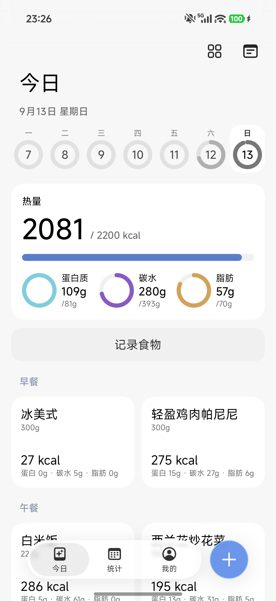
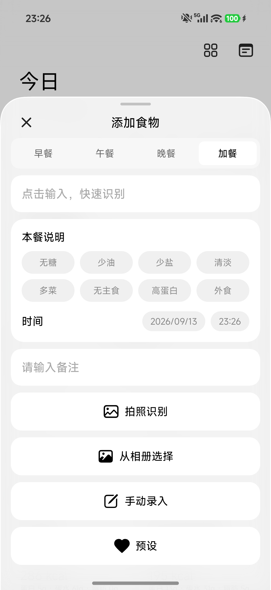
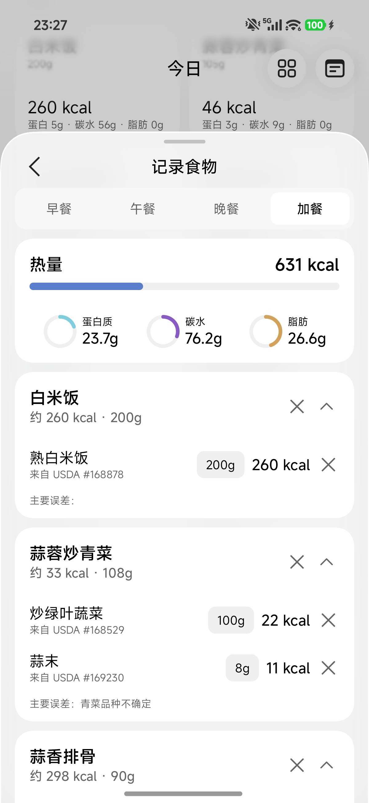
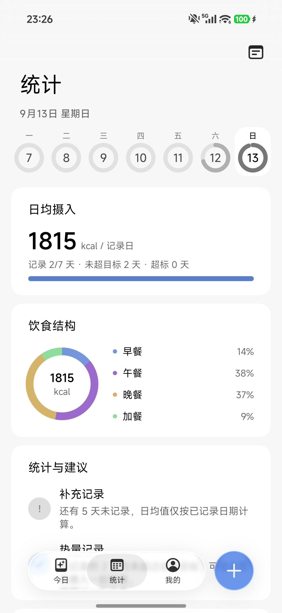

# LightMemo · 轻食记

拍照识别或手动记录一餐的热量与营养，准确拆分基础食物，数据库匹配热量与营养。

---

## 功能展示

### 今日

- **热量总览**：当日摄入大数字 + 进度条，对照每日目标一眼可见
- **三大营养素环**：蛋白质 / 碳水 / 脂肪各自进度与目标
- **按餐次组织**：早餐、午餐、晚餐、加餐；卡片式全览

<p align="center">
  
</p>

### 记录一餐

- **多种方式任选：** 总有一种你想要的
- **识别上岛***：接入安卓16实时更新通知，支持的系统可以上岛
- **识别流程**：图片质量检查 → 菜品识别 → 组成拆解 → 二次视觉审核 → 映射标准食物 → 按重量计算
- **丰富的识别结果**：按菜品展示组成、估计重量区间、置信度与数据出处；改动即时重算

<p align="center">
  
  
</p>

### 统计

- **日均与达标**：记录日数、日均热量、未超目标 / 超标天数
- **饮食结构**：各餐次热量占比环图
- **每日柱状图**：近一段时间逐日摄入，点选查看单日详情
- **摄入建议**：实时推荐摄入种类

<p align="center">
  
</p>


---

## 界面

整体是 HyperOS 风格的液态玻璃，这太Hyper了

| 区域 | 表现 |
|------|------|
| 底栏 | 胶囊玻璃 Tab，拖动时有阻尼拉伸与速度拉长；圆形液态玻璃按钮可按压缩放、拖拽跟手形变 |
| 顶栏 | 可折叠大标题 + 渐进模糊；右侧液态图标按钮（管理卡片、切换月视图） |
| 卡片 | Miuix `Card`，内容区统一 16dp 边距； |
| 弹层 | 毛玻璃 Bottom Sheet |
|  |


---

## 技术

### 栈

- **Kotlin** + **Jetpack Compose**（BOM 2025.10）+ **AGP 9** / JDK 21
- **UI**：本地 `miuix-glass`（`top.yukonga.miuix.kmp:*-android:0.9.4-rclocal`）
- **持久化**：DataStore JSON 日志 + DataStore 设置
- **网络**：OkHttp + kotlinx.serialization
- **图像**：Coil 3
- **识别**：OpenAI 兼容 `chat/completions` Vision（菜品拆解、估重、审核）
- **营养库**：
  - USDA FoodData Central SR Legacy 离线库（约 7,793 条，确定性计算）
  - 中国食物成分表第 6 版离线回退（约 1,635 条完整宏量）
  - 可选 USDA 在线 API；查询顺序：离线 USDA → API → 中国库

### 模块结构

```
app/
├── ui/          页面、液态玻璃组件、特效（highlight / edge light / overscroll）
├── data/        FoodLog 仓库、设置、预设食物、校验
├── domain/      Nutrition / FoodLog / MealType
├── network/     Vision 客户端、USDA FDC 客户端
└── viewmodel/   Today / Stats / Add / Settings / Backup
```

### 构建

```powershell
# 需 JDK 21 + Android SDK 37，local.properties 配置 sdk.dir
.\gradlew :app:assembleDebug
.\gradlew :app:testDebugUnitTest
```

APK：`app/build/outputs/apk/debug/app-debug.apk`

依赖本机 `~/.m2` 中的 miuix 本地包。若改过 miuix 源码，在 `miuix-glass` 工程执行各模块 `publishAndroidPublicationToMavenLocal`（`-Prc=local`）。

### 应用更新

应用启动时会检查 GitHub 仓库的最新 Release。发现新版本后，用户可以在弹窗中打开 Release 页面并下载 APK；

### 使用前配置

1. 打开 App → 设置
2. 填入api key；默认使用 DeepSeek配置，也可填写其他 OpenAI 兼容服务的 Base URL、API Key 和模型名
3. 设置每日热量目标
4.  可选：USDA FDC API Key


第三方许可与数据来源见 [`docs/THIRD-PARTY-NOTICES.md`](docs/THIRD-PARTY-NOTICES.md)。
